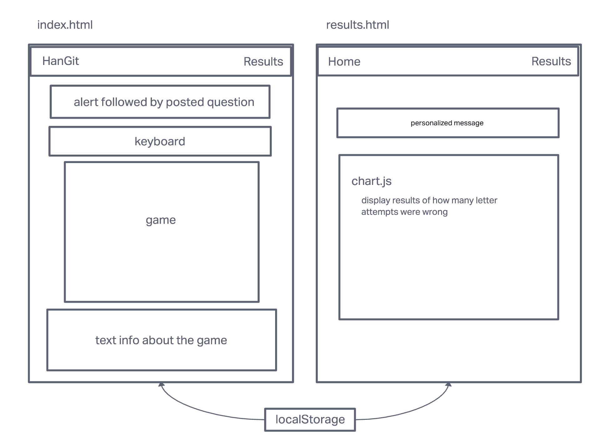

  

# ||  Foundations of Software Development - Group Project ||

# HanGit

*Code 201 Final Project - Hangman Git Command Game*

---

## Group Members

- Dustin Apodaca
- Maximo VincenteMejia
- Michael Kancov
- Mathieu Roberts

___

- HanGit is an interactive app, using the "Hangman" game as a model to help developers learn git commands.

- HanGit will help beginners with Git and Github in an interactive game format.

---

### Wireframe

  

### User Stories

1. Title: HanGit

2. User Story Sentences:

  - As a software development student, I want a fun way to learn about Git and Git commands, so that I can be better equipped for the development field and version control.

  - As a junior developer, I want to learn Git commands before my first day of work to not annoy my teammates with simple Git questions, and focus on bigger tasks.

  - As a Code Fellows Instructor, I want students to go above and beyond on their projects, so that they learn how to be creative problem solvers for future employers.

  - As a user, I want to learn Git commands by a list of realistic git scenarios.

  - As a self-taught developer I want to learn an effective way to locally and remote store my personal projects so that they can be deployed to be viewed by potential hiring partners.

3. Feature Tasks:

- User can choose the letter to fill in the answer block.

- User can reset to start the game over.

4. Acceptance Test:

- Ensure user can go through answering the questions and if right, have their score displayed in results page that displays a visual graphic of those results.

---

